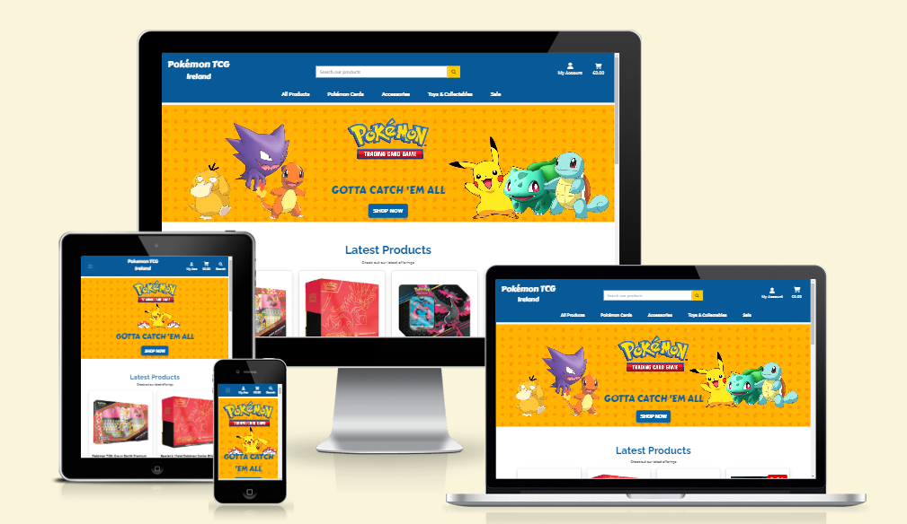

# Pokemon TCG Ireland

Pokemon TCG Ireland is a website designed for a local shop that deals in selling pokemon based products. It allows its customers to purchase items directly from them online. Pokemon TCG Ireland, your one stop Pokemon shop (in Dublin) for all Pokemon TCG products



<div style="text-align: center; font-size: 34px; font-weight: bold; text-decoration: underline ">

[Pokemon TCG Ireland Live site](https://pokemon-tcg-ireland-ad52d37e70f9.herokuapp.com/)

</div>

# Table of Contents

1. [Introduction](#pokemon-tcg-ireland)
2. [User Experience](#user-experience)
    - [Initial Discussion](#initial-discussion)
    - [User stories](#user-stories)
3. [Design](#design)
    - [Colour scheme](#colour-scheme)
    - [Typography](#typography)
    - [Wireframes](#wireframes)
    - [Database Entity relationship diagram](#database-erd)
    - [Agile Development](#agile-development)
        - [User stories and Epics](#user-stories-and-epics)
        - [Project backlog](#project-backlog)
        - [MoSCow prioritization](#moscow-prioritization)
        - [Iterations](#iterations)
        - [Information radiator (board)](#information-radiator-board)
4. [Features](#features)
    - [Navigation](#navigation)
    - [Footer](#footer)
    - [Home Page](#home-page)
    - [Sign up Page](#sign-up-page)
    - [Sign in Page](#sign-in-page)
    - [Log out Page](#log-out-page)
    - [Profile Page](#profile-page)
    - [Products Page](#products-page)
    - [Product Details Page](#product-details-page)
    - [Basket Page](#basket-page)
    - [Checkout Page](#basket-page)
    - [Checkout Success / Order History Page](#checkout-page)
    - [Add / Edit Products Page](#add--edit-products-page)
    - [Delete products](#delete-product-functionality)
    - [Privacy Policy](#privacy-policy)
    - [About Us Page](#about-us-page)
    - [Contact Us Page](#contact-us-page)
    - [Messaging](#messaging)
    - [Error pages](#error-pages)
    - [Admin Panel](#admin-panel)
    - [Newsletter](#newsletter)
    - [Password Reset](#password-reset)
    - [Email Verification](#email-verification)
    - [Back to Top Button](#back-to-top-button)
    - [Basket Badge](#basket-badge)
    - [Items On Sale](#items-on-sale)
    - [Form validation](#form-validation)
    - [ToolTips](#tooltips)
    - [Button Disabling](#button-disabling)
    - [Max Product Entry Protection](#max-product-entry-protection)
    - [Order Confirmation Email](#order-confirmation-email)
    - [Future Implementations](#future-implementations)
    - [Accessibility](#accessibility)
5. [E-commerce Business Model](#e-commerce-business-model)
    - [Search Engine Optimisation](#search-engine-optimisation)
    - [Social Media Marketing](#social-media-marketing)
    - [Newsletter](#newsletter-marketing)
    - [Future Strategies](#future-strategies)
6. [Technologies used](#technologies-used)
    - [Languages](#languages)
    - [Libraries, Modules, classes imported](#libraries-modules-classes-imported)
    - [Version control](#version-control)
    - [Programs](#programs)
    - [Tools](#tools)
7. [Dependency setup, Deployment & Local Deployment](#dependency-setup-deployment--local-deployment)
    - [Elephant SQL setup](#elephant-sql-setup)
    - [AWS Setup](#aws-setup)
    - [Stripe API Setup](#stripe-api-setup)
    - [Gmail API Setup](#gmail-api-setup)
    - [Heroku Deployment](#heroku-deployment)
    - [Local Deployment](#local-deployment)
        - [How to Fork](#how-to-fork)
        - [How to Clone](#how-to-clone)
8. [Testing](#testing)
9. [Credits](#credits)
    - [Copy](#copy)
    - [Imagery](#images)
    - [Code/Tutorials](#code--tutorials)
    - [Acknowledgements](#acknowledgements)

# User Experience

## Initial Discussion

Pokemon TCG Ireland is a website that I (Gary Dolan) developed for my fifth project as part of Code Institutes Diploma in Full Stack Software Development. Pokemon TCG Ireland is an e-commerce website that was developed for a fictional local shop that deals in Pokemon based products.

## User stories

### Owner/Admin & Developer goals

-   As a developer I can carry out project planning so that the website has a clear development direction going forward.[#1](https://github.com/GaryDolan/ci-p5-pokemon-tcg-ireland/issues/1)
-   As a developer I can create user stories and epics so that the projects work is well planned out and prioritised before coding begins.[#2](https://github.com/GaryDolan/ci-p5-pokemon-tcg-ireland/issues/2)
-   As a developer I can select a colour scheme so that the websites colouring creates a positive user experience and also meets the stakeholders aesthetic goals.[#3](https://github.com/GaryDolan/ci-p5-pokemon-tcg-ireland/issues/3)
-   As a developer I can select the websites fonts so that I can provide a good user experience, highlighting readability and stakeholder branding goals.[#4](https://github.com/GaryDolan/ci-p5-pokemon-tcg-ireland/issues/4)
-   As a developer I can construct wire-frames so that I have details of the website layout, features and style before coding begins.[#5](https://github.com/GaryDolan/ci-p5-pokemon-tcg-ireland/issues/5)
-   As a developer I can create an entity relationship diagram so that I can define all database entities, the information they will store and their relationship to one another.[#6](https://github.com/GaryDolan/ci-p5-pokemon-tcg-ireland/issues/6)
-   As a developer I can decided on what individual apps my project will contain so that I can separate my code into different apps based on their functionality.[#7](https://github.com/GaryDolan/ci-p5-pokemon-tcg-ireland/issues/7)
-   As a developer I can setup my IDE so that I can develop a Django based project.[#9](https://github.com/GaryDolan/ci-p5-pokemon-tcg-ireland/issues/9)
-   As a developer I can setup a new Django project and apps so that I can create the basic project structure.[#10](https://github.com/GaryDolan/ci-p5-pokemon-tcg-ireland/issues/10)
-   As a developer I can setup my database so that my data can be stored using the database.[#11](https://github.com/GaryDolan/ci-p5-pokemon-tcg-ireland/issues/11)
-   As a developer I can deploy my project to Heroku so that I can confirm correct operation early in the project.[#12](https://github.com/GaryDolan/ci-p5-pokemon-tcg-ireland/issues/12)
-   As a developer I can add styling to the website so that it is visually appealing to the user, easy to use and all content is accessible and readable.[#17](https://github.com/GaryDolan/ci-p5-pokemon-tcg-ireland/issues/17)
-   As a developer I can create custom error templates for common errors so that the user is provided with a safe way to return to our website if an error occurs and the website maintains a good UX.[#18](https://github.com/GaryDolan/ci-p5-pokemon-tcg-ireland/issues/18)
-   As a developer I can create a robots.txt so that I can control the access search engine crawlers have to parts of my website. [#57](https://github.com/GaryDolan/ci-p5-pokemon-tcg-ireland/issues/57)
-   As a developer I can create an SEO sitemap so that search engine crawlers can effectively crawl and index the pages on my website.[#58](https://github.com/GaryDolan/ci-p5-pokemon-tcg-ireland/issues/58)
-   As a developer I can create a facebook page for marketing, promoting and showcasing my website to potential customers so that I can direct potential customers to my website.[#59](https://github.com/GaryDolan/ci-p5-pokemon-tcg-ireland/issues/59)
-   As a developer I can ensure meta tags keywords etc are used so that the correct content can be easily accessed.[#60](https://github.com/GaryDolan/ci-p5-pokemon-tcg-ireland/issues/60)
-   As a developer I can add comments and docs strings so that at a glance the reader will understand the functions of various elements of the code.[#63](https://github.com/GaryDolan/ci-p5-pokemon-tcg-ireland/issues/63)
-   As a developer I can carry out user story testing so that I can confirm the finished project meets the user story requirements.[#67](https://github.com/GaryDolan/ci-p5-pokemon-tcg-ireland/issues/67)
-   As a developer I can carry out validation of my code so that I can ensure it complies to coding guidelines.[#68](https://github.com/GaryDolan/ci-p5-pokemon-tcg-ireland/issues/68)
-   As a developer I can carry out manual site testing so that I can confirm the correct operation of the website.[#69](https://github.com/GaryDolan/ci-p5-pokemon-tcg-ireland/issues/69)
-   As a developer I can carry out lighthouse testing on all my webpages so that I can assess my websites performance and accessibility.[#70](https://github.com/GaryDolan/ci-p5-pokemon-tcg-ireland/issues/70)
-   As a developer I can carry out responsive design testing so that I can ensure my website works on a variety of screen sizes, from mobile to large desktop.[#71](https://github.com/GaryDolan/ci-p5-pokemon-tcg-ireland/issues/71)
-   As a developer I can add messaging to the website so that I can provide the user with feedback regarding the action they have performed.[#77](https://github.com/GaryDolan/ci-p5-pokemon-tcg-ireland/issues/77)
-   As a developer I can carry out wave testing on all my webpages so that my websites accessibility is excellent and free of errors.[#91](https://github.com/GaryDolan/ci-p5-pokemon-tcg-ireland/issues/91)
-   As a superuser I can add a product so that I can add products to my online store.[#38](https://github.com/GaryDolan/ci-p5-pokemon-tcg-ireland/issues/38)
-   As a superuser I can edit a product so that I can change the details of an existing product, including name, description, images, price, product code, category and others.[#39](https://github.com/GaryDolan/ci-p5-pokemon-tcg-ireland/issues/39)
-   As a superuser I can delete a product so that I can remove items which are no longer available to purchase.[#40](https://github.com/GaryDolan/ci-p5-pokemon-tcg-ireland/issues/40)
-   As a superuser I can perform CRUD operations on user profiles so that I can manage and where applicable delete or edit user profiles.[#41](https://github.com/GaryDolan/ci-p5-pokemon-tcg-ireland/issues/41)

### First time visitor goals

-   As a user I can navigate through the website with ease understanding layout and calls to action so that I can make use of the websites various functionality, allowing me to easily purchase products.[#14](https://github.com/GaryDolan/ci-p5-pokemon-tcg-ireland/issues/14)
-   As a user I can view the website on multiple devices with different screen sizes so that I can have an excellent viewing experience regardless of the device I use.[#16](https://github.com/GaryDolan/ci-p5-pokemon-tcg-ireland/issues/16)
-   As a user I can sign up and create an account so that I can have an account and view my personal profile.[#20](https://github.com/GaryDolan/ci-p5-pokemon-tcg-ireland/issues/20)
-   As a user I can receive a sign up confirmation email so that I can verify my account sign up was successful.[#24](https://github.com/GaryDolan/ci-p5-pokemon-tcg-ireland/issues/24)
-   As a user I can view a home page so that I can be introduced to the store and its products.[#72](https://github.com/GaryDolan/ci-p5-pokemon-tcg-ireland/issues/72)
-   As a shopper I can view a list products so that I can choose whats ones I would like to purchase.[#32](https://github.com/GaryDolan/ci-p5-pokemon-tcg-ireland/issues/32)
-   As a shopper I can click on a product in the list so that I can view full details such as price, features, description, images, warnings, reviews.[#33](https://github.com/GaryDolan/ci-p5-pokemon-tcg-ireland/issues/33)
-   As a shopper I can quickly and easily view discounted items so that I can take advantage of special offers on items I would like to purchase.[#34](https://github.com/GaryDolan/ci-p5-pokemon-tcg-ireland/issues/34)
-   As a shopper I can view the current total of my items in my basket so that I can ensure I do not spend more than expected.[#35](https://github.com/GaryDolan/ci-p5-pokemon-tcg-ireland/issues/35)
-   As a shopper I can add products to my wish-list so that I can save products that I wish to purchase at a later date.[#36](https://github.com/GaryDolan/ci-p5-pokemon-tcg-ireland/issues/36)
-   As a shopper I can search and sort products so that I can quickly and easily find the products I wish to purchase.[#42](https://github.com/GaryDolan/ci-p5-pokemon-tcg-ireland/issues/42)
-   As a shopper I can sort the list of available products so that I can view products based on a number of criteria such as name price, rating, category, set, expansion.[#43](https://github.com/GaryDolan/ci-p5-pokemon-tcg-ireland/issues/43)
-   As a shopper I can filter a product category so that I can find items in a specific category.[#44](https://github.com/GaryDolan/ci-p5-pokemon-tcg-ireland/issues/44)
-   As a shopper I can sort multiple product categories at the same time so that I can find items in multiple categories at the same time.[#45](https://github.com/GaryDolan/ci-p5-pokemon-tcg-ireland/issues/45)
-   As a shopper I can search for products by name and description so that I can find a products which I would like to purchase.[#46](https://github.com/GaryDolan/ci-p5-pokemon-tcg-ireland/issues/46)
-   As a shopper I can see my search results and the number of them so that I can see if a product I have searched for is available.[#47](https://github.com/GaryDolan/ci-p5-pokemon-tcg-ireland/issues/47)
-   As a shopper I can select the quantity of a product so that I can purchase the correct number of products.[#49](https://github.com/GaryDolan/ci-p5-pokemon-tcg-ireland/issues/4)
-   As a shopper I can view the items I have added to my cart so that I can see a summary of my intended purchases.[#50](https://github.com/GaryDolan/ci-p5-pokemon-tcg-ireland/issues/50)
-   As a shopper I can change the quantity of items in my shopping bag so that I can make adjustments to the products I wish to purchase before I checkout.[#51](https://github.com/GaryDolan/ci-p5-pokemon-tcg-ireland/issues/51)
-   As a shopper I can enter my payment information so that I can pay for my items at checkout.[#52](https://github.com/GaryDolan/ci-p5-pokemon-tcg-ireland/issues/52)
-   As a shopper I can be sure my information is secure so that I am happy to provide all information to make a purchase.[#53](https://github.com/GaryDolan/ci-p5-pokemon-tcg-ireland/issues/53)
-   As a shopper I can view my order confirmation after checkout so that I can ensure my order is correct.[#54](https://github.com/GaryDolan/ci-p5-pokemon-tcg-ireland/issues/54)
-   As a shopper I can receive a confirmation emails after a purchase so that I know my order has been placed and I have a copy of my purchases.[#55](https://github.com/GaryDolan/ci-p5-pokemon-tcg-ireland/issues/55)
-   As a user I can see messages whenever I perform an action so that I can know if my actions were successful, caused errors etc.[#84](https://github.com/GaryDolan/ci-p5-pokemon-tcg-ireland/issues/84)

### Returning visitor goals

-   As a user I can click on the art clubs social links in the footer so that I can visit the art clubs various social networks and interact with them.[#15](https://github.com/GaryDolan/ci-p5-pokemon-tcg-ireland/issues/15)
-   As a user I can login so that I can access my account, order history etc.[#21](https://github.com/GaryDolan/ci-p5-pokemon-tcg-ireland/issues/21)
-   As a user I can logout so that I can no longer access my account and associated functionality.[#22](https://github.com/GaryDolan/ci-p5-pokemon-tcg-ireland/issues/22)
-   As a user I can recover my password so that regain access to my personal account.[#25](https://github.com/GaryDolan/ci-p5-pokemon-tcg-ireland/issues/25)
-   As a user I can view my profile page so that I can edit my account info (address etc.).[#26](https://github.com/GaryDolan/ci-p5-pokemon-tcg-ireland/issues/26)
-   As a user I can edit all of my profile details so that keep my account information up to date.[#27](https://github.com/GaryDolan/ci-p5-pokemon-tcg-ireland/issues/27)
-   As a user I can edit my password so that I can keep my account secure.[#28](https://github.com/GaryDolan/ci-p5-pokemon-tcg-ireland/issues/28)
-   As a user I can view my order history so that I can check items which I have previously purchased.[#29](https://github.com/GaryDolan/ci-p5-pokemon-tcg-ireland/issues/29)
-   As a user I can view my wish-list so that I can purchase item which I saved to it earlier.[#30](https://github.com/GaryDolan/ci-p5-pokemon-tcg-ireland/issues/30)
-   As a user I can I can sign up to the newsletter so that I can be kept up to date with the latest product releases and offers.[#61](https://github.com/GaryDolan/ci-p5-pokemon-tcg-ireland/issues/61)
-   As a user I can view the websites privacy policy so that I can understand how my information is used.[#73](https://github.com/GaryDolan/ci-p5-pokemon-tcg-ireland/issues/73)
-   As a user I can view an about us page so that I can learn all about the company.[#74](https://github.com/GaryDolan/ci-p5-pokemon-tcg-ireland/issues/74)
-   As a user I can fill out a contact form so that I can communicate with the website owner directly.[#75](https://github.com/GaryDolan/ci-p5-pokemon-tcg-ireland/issues/75)
-   As a user I can submit a review on a product so that other site users can quickly gauge my opinion of the product.[#80](https://github.com/GaryDolan/ci-p5-pokemon-tcg-ireland/issues/80)

[Return to Table of Contents](#table-of-contents)

# Design

## Colour scheme

The colour scheme for the website was chosen based on discussions with the client. He wanted to use a dark blue as the main colour throughout the website. Based on some investigation and using some color pallet generators we decided that we would use yellow as our secondary colour for calls to action and items that could be interacted with such as menus etc. We would also use blue for some calls to action with lesser importance, mainly around decisions which return the users to previous ages etc. Blue was only used when there was another call to action on the page that was yellow or in one case where contrast with an image was an issue.


-   #075997: This was chosen based on the colours wanted by the client. This is used for heading text, header and footer background colour, some buttons etc.
-   #FEC901: This was used as the main call to action for the website in buttons, menu hovering, star selection when reviewing etc.
-   #EB0000: This colour was used on some buttons with some more serious actions such as deleting a product or review. It was also used for the wishlist heart icon.
-   #FAFAFA: This colour was originally used as a background colour for pages with containers that showed borders and shadows. This was removed upon review with the client and is only present in some logos.
-   #EBEBEB: This colour was originally used to style less important text on product cards, such as sku's, categories and expansions. It was also used for the star ratings when no rating had been applied. This was later removed from use in all cases but the review stars and wave flagged it as error for accessibility.

All colours combinations were checked and comply to WCAG standards, tested on [Webaim](https://webaim.org/resources/contrastchecker/). I also used [Coolors](https://coolors.co/) to visualise my palette.

## Typography

When considering fonts, I used a combination of [Google fonts](https://fonts.google.com/) to research fonts, [Font joy](https://fontjoy.com/) to compare various fonts. I decided to use a font I had used on a previous project called Roboto because it was modern and versatile, offered a wide variety of weights.

For the heading font I used the Raleway font as it was clean and elegant. I did also use the Carter one font in two places to bolster a sense of fun. It was used in the site logo and on some text in the home page hero image.


## Wireframes

All the wireframes for the website were created using the Balsamic desktop application.

### Desktops

<details>

<summary style="font-size: 20px; font-weight: bold;">Home</summary>


</details>

<details>

<summary style="font-size: 20px; font-weight: bold;">About Us</summary>


</details>

<details>

<summary style="font-size: 20px; font-weight: bold;">Add/Edit Products</summary>


</details>

<details>

<summary style="font-size: 20px; font-weight: bold;">Basket</summary>


</details>

<details>

<summary style="font-size: 20px; font-weight: bold;">Checkout</summary>


</details>

<details>

<summary style="font-size: 20px; font-weight: bold;">Checkout Success</summary>


</details>

<details>

<summary style="font-size: 20px; font-weight: bold;">Contact Us</summary>


</details>

<details>

<summary style="font-size: 20px; font-weight: bold;">Error pages</summary>


</details>

<details>

<summary style="font-size: 20px; font-weight: bold;">Login</summary>


</details>

<details>

<summary style="font-size: 20px; font-weight: bold;">Logout</summary>


</details>

<details>

<summary style="font-size: 20px; font-weight: bold;">Privacy Policy</summary>


</details>

<details>

<summary style="font-size: 20px; font-weight: bold;">Product Details</summary>


</details>

<details>

<summary style="font-size: 20px; font-weight: bold;">Products</summary>


</details>

<details>

<summary style="font-size: 20px; font-weight: bold;">Profile</summary>


</details>

<details>

<summary style="font-size: 20px; font-weight: bold;">Register</summary>


</details>

### Mobile

<details>

<summary style="font-size: 20px; font-weight: bold;">Home</summary>


</details>

<details>

<summary style="font-size: 20px; font-weight: bold;">About Us</summary>


</details>

<details>

<summary style="font-size: 20px; font-weight: bold;">Add/Edit Products</summary>


</details>

<details>

<summary style="font-size: 20px; font-weight: bold;">Basket</summary>


</details>

<details>

<summary style="font-size: 20px; font-weight: bold;">Checkout</summary>


</details>

<details>

<summary style="font-size: 20px; font-weight: bold;">Checkout Success</summary>


</details>

<details>

<summary style="font-size: 20px; font-weight: bold;">Contact Us</summary>


</details>

<details>

<summary style="font-size: 20px; font-weight: bold;">Error pages</summary>


</details>

<details>

<summary style="font-size: 20px; font-weight: bold;">Login</summary>


</details>

<details>

<summary style="font-size: 20px; font-weight: bold;">Logout</summary>


</details>

<details>

<summary style="font-size: 20px; font-weight: bold;">Privacy Policy</summary>


</details>

<details>

<summary style="font-size: 20px; font-weight: bold;">Product Details</summary>


</details>

<details>

<summary style="font-size: 20px; font-weight: bold;">Products</summary>


</details>

<details>

<summary style="font-size: 20px; font-weight: bold;">Profile</summary>


</details>

<details>

<summary style="font-size: 20px; font-weight: bold;">Register</summary>


</details>

There were some deviations from the above wireframes as the website was developed, including not using images is placed which I initially planned to and modifications to form fields. I also decided to split the user account editing into two forms, edit info and edit profile. I finally decided on a different, more centered layout for the users profile page.

## Database ERD

My Entity relationship diagram can be seen below and represents the models in my database and their relationship to one another. I have 11 models which are the User, UserProfile, Review, Wishlist, Order, OrderLineItem, Product, Category, CardSet, Expansion and Contact. Their relationships in my ERD are as follows

-   The UserProfile model has a one to one relationship with the User model, as each User has one UserProfile.
-   The Review model has a one to many (Foreign Key) relationship with the User model, as one user can post many Reviews.
-   The Review model has a one to many (Foreign Key) relationship with Product model as one Product can have many Reviews.
-   The Order model has a one to many (Foreign Key) relationship with UserProfile model as one UserProfile can have many orders.
-   The Wishlist model has a OneToOne relationship with the UserProfile as one UserProfile can have one Wishlist
-   The Wishlist model has a ManyToMany relationship with the Product model as many Wishlists can contain Many products.
-   The OrderLineItem model has a one to many (Foreign Key) relationship with the Order model as one Order can have many OrderLineItems.
-   The OrderLineItem has a one to many (Foreign Key) relationship with the Product model as many OrderLineItems can contain one Product. Each OrderLineItem represents one Product.
-   The Product model has a one to many (Foreign Key) relationship with the Category model as one Category can be associated with many Products. Each product can only have one Category.
-   The Product model has a one to many (Foreign Key) relationship with the CardSet model as one CardSet can be associated with many Products. Each product can only belong to one CardSet.
-   The Product model has a one to many (Foreign Key) relationship with the Expansion model as one Expansion can be associated with many Products. Each product can only belong to one Expansion.


## Agile Development

During this project the Agile development principles were used. Using these principles allowed me to prioritise flexibility and focus on client collaboration throughout the development. It allowed me to continually provide the client with new features to test, and use the provided feedback to make changes. The way in which I implemented Agile in my project is described below.

### User stories and Epics

During the project planing stage I met with the client and discussed what the functional requirements for the website would be from his point of view. During this meeting I also suggested some requirements that would be useful and after the meeting I added some more from my point of view as a developer. I used this list of functional requirements to create user stories, represented by issues on github. Any requirement that was too large to be considered a user story was labelled as an Epic and then broken down into user stories contained in that epic. From our requirements I created 11 [epics](https://github.com/GaryDolan/ci-p5-pokemon-tcg-ireland/issues?q=label%3Aepic+is%3Aclosed) and some additional user stories totalling 93 user stories.9 of these user stories we bugs added as I progressed through my development. When an epic was created all related user stories within that epic were referenced inside of the it.


### Project backlog

Once the user stories were analysed and approved for inclusion in the project, they were moved to the product backlog. This is represented by a milestone with no completion date in github. Once the user stories were assigned to the backlog they were given tasks, that needed to be undertaken to complete them and pass criteria, which needed to be met for them to be considered complete.

### MoSCoW prioritization

All user stories in backlog they were given github labels based on the MoSCow prioritization technique. They were given one of four labels, "Must-Have", "Should-Have", "Could-Have" or "Wont have". This was decided upon in another consultation with the client and allowed me to prioritise user stories that were Must-Haves first. The MoSCow technique is dynamic in nature and thus allows for the labels on user stories to be changed if they become less or more important during the iterations.

### Story points

Once the user stories are labelled according to MoSCoW, they are the assigned story points (github label) based on fibonacci sequence. Story points allowed me to estimate the relative complexity of the user stories. Each story was assigned a label of 1,2,3,5,8 or 13 depending on its complexity relative to one another. This allows a team or in my case solo velocity to be ascertained for an iteration, which aids in the planning of the next iteration. The fibonacci sequence is used because it is a non linear scale and the idea is that it highlights the uncertainty in estimating larger tasks.

### Iterations

Once all user stories are prioritised and given story points it is time to add them to an iteration. Iterations are represented by milestones with a fixed end date in github. The idea is to add a certain number of user stories to an iteration so that the sum of the user stories story points matches the team velocity (solo in my case). I decided to create 7 [iterations](https://github.com/GaryDolan/ci-p5-pokemon-tcg-ireland/milestones?state=closed), each of which would be one week long. Due to the fact that I did not have a known velocity I simply totalled the story points of all user stories and divided by seven. This would mean that if for each iteration, I could attain a velocity equal to one seventh of the total story points I would complete them all in the available iterations. Once an iteration reached its close date all incomplete tasks were moved back to the product backlog for refinement into the next iteration.

### Information radiator (board)

To aid in keeping track of the status of the user stories in each iteration I created seven [board information radiators](https://github.com/GaryDolan/ci-p5-pokemon-tcg-ireland/projects?query=is%3Aclosed) one for each iteration, these are represented by github projects. Each board had 4 sections, Todo, In progress, Done and Project backlog. At the start of each iteration the user stories to be completed in that iteration were moved to the ToDo section of the board. As I worked on and completed tasks they were moved to in progress and finally done. The project backlog was included so that I could dynamically adjust the iteration as the need arose, returning downgraded user stories to it or taking stories from the backlog to add to an iteration.


[Return to Table of Contents](#table-of-contents)

# Features

Below is a explanation of the features of the Website. All elements of the website are fully responsive across all pages from 320px up, taking advantage of bootstrap and media queries to achieve this.

## Navigation

The website navigation is also common to all pages of the website, it is simple, intuitive and easy to use. On mobile it contains a collapsed menu to save space. The search bar can be expanded by clicking the search icon to reval the search input. The account icon allows user to access the login and register pages and when logged in this icon allows them to access their profile or log out. For superusers the account icon will also contain an additional menu for adding a product to the website. The navigation also contains a icon to allow the users to access their shopping basket when clicked. On desktop the functionality remains the same but the menu is not collapsed nor is the search input. On desktop the home logo is also displayed which is part of the menu on mobile.

<details>

<summary style="font-size: 20px; font-weight: bold;">Mobile </summary>


</details>

<details>

<summary style="font-size: 20px; font-weight: bold;">Mobile(collapsed menu)</summary>


</details>

<details>

<summary style="font-size: 20px; font-weight: bold;">Desktop</summary>


</details>

<details>

<summary style="font-size: 20px; font-weight: bold;">Desktop(logged in)</summary>


</details>

## Footer

The footer is another item which is common to all pages in the website. When initially meeting the client, I showed him some of my previous work and he seemed to like the idea of a simple footer with just social media links in it via icons. Each icon is coloured according to its branding. When hovered over the icons will increase in size and brightness to supply the user with feedback to indicate to the user that they are clickable (this is a common idea throughout the website). If any of the social network icons are clicked it will bring the user to the relevant one for the shop (opened in a new tab). At the moment the shop only has a facebook page so some of the icons lead to the websites homepage. The footer also contains a Information section which I added to hold links that would be used much less often by the user. Finally the footer has a newsletter sign up form that is linked to the mailchimp service.

<details>

<summary style="font-size: 20px; font-weight: bold;">Mobile </summary>


</details>

<details>

<summary style="font-size: 20px; font-weight: bold;">Desktop</summary>


</details>

## Home Page

The homepage of the websites tries to accomplish the one main task immediately, which is to get the user to view and buy products. The user is met with a hero image on the homepage, overlayed on top of the image is a shop now button which will direct the users to the all products page when clicked. Under the initial image the homepage has two sections, the latest products section and the popular products section. The latest products section displays the 4 newest products based on the date that the products have been added to the website. The popular products section displays the four most popular products available to buy on the website. This is based on the average rating of all reviews added to the products.

<details>

<summary style="font-size: 20px; font-weight: bold;">Mobile </summary>


</details>

<details>

<summary style="font-size: 20px; font-weight: bold;">Desktop</summary>


</details>

## Sign up Page

This page allows the user to create a new account. The page contains a form with fields for email, email confirm, username, password and password again, followed by a sign up button. Once filled out correctly and the button is pressed the users new account and profile will be created and the user will be redirected to the home page. The sign up page also contains a link for sign in incase the user already has an account.

<details>

<summary style="font-size: 20px; font-weight: bold;">Mobile </summary>


</details>

<details>

<summary style="font-size: 20px; font-weight: bold;">Desktop</summary>


</details>

## Sign in Page

This page allows the user to log into their account. The page contains a form with fields for username and password , followed by a sign in button. Once filled out correctly and the button is pressed the users will be logged in and redirected to the home page. The sign up page also contains a link for sign up incase the user does not already have an account.

<details>

<summary style="font-size: 20px; font-weight: bold;">Mobile </summary>


</details>

<details>

<summary style="font-size: 20px; font-weight: bold;">Desktop</summary>


</details>

## Log out Page

This page allows the user to log out of their account. The page contains a message asking the user to confirm the sign out, followed by a sign out button. Once the button is pressed the users will be logged out and redirected to the home page.

<details>

<summary style="font-size: 20px; font-weight: bold;">Mobile </summary>


</details>

<details>

<summary style="font-size: 20px; font-weight: bold;">Desktop</summary>


</details>

## Profile Page

The profile page contains the following 5 sections which are inside collapsed containers to improve UX as the user can quickly and clearly see all available profile functionality at a glance. The 5 sections are,

-   Account info
    This section contains a form which allows the user to update their first and last name associated with their profile
-   Shipping info
    This section contains a form which allows the user to update their shipping information.
-   Password
    This section contains a form which allows the user to update their account password
-   Order history
    This section contains a scrollable list of all the users order history. The orders are summerised showing order number date and total cost. The order numbers are links that will bring the user to the order success page for that order showing the user full details of the order.
-   Wishlist
    This section contains a list of products that the user has added to their wishlist. It shows the product image name and price followed by a heart icon that the user can click to remove the item from their wishlist. When hovered the heart icon will display a tooltip telling the user its function is to remove the product from the wishlist. If the product is on sale an on sale badge will be overlayed on the product image and the price will be displayed in red. This is to encourage the user to buy the item. The product image is also clickable and will return the user to the product details page, where they can add it to their basket. As a future addition I would like to add an add to basket button beside each product to encourage the user to impulsively buy the item.

All forms on the profile page have validation.

<details>

<summary style="font-size: 20px; font-weight: bold;">Mobile </summary>


</details>

<details>

<summary style="font-size: 20px; font-weight: bold;">Desktop</summary>


</details>

<details>

<summary style="font-size: 20px; font-weight: bold;">Profile(sections expanded)</summary>


</details>

## Products Page

The products page is one of the main pages of the website and displays the products that are available for purchase. It displays the products as summaries in a card based format. The product cards contain a brief overview of the product including an image, name, price, category, card set and expansion (if applicable), a rating and finally a button to add the item directly to the users basket.

<details>

<summary style="font-size: 20px; font-weight: bold;">Mobile </summary>


</details>

<details>

<summary style="font-size: 20px; font-weight: bold;">Desktop</summary>


</details>

The are many was the user can interact with the products page and the main navigation acts as a way for the user to filter and sort the products pages. The navigation menu allows the user to sort all products based on price (lowest first), rating (highest first), category (A-Z). It also allows a user to filter and display items that are marked on sale via the on sale nav link. Finally the navigation menu allows the user to filter by all of the individual categories using 3 more dropdown nav menus which group related categories together. The user has the following options for sorting and filtering the products page via the navigation menu,

-   Sort and display all products by,
    -   Price
    -   Rating
    -   Category
    -   All cards
-   Filter and display all pokemon cards by categories that are associated with products containing cards, such as,
    -   Booster Packs
    -   Booster Bundles
    -   Booster Boxes
    -   Boxed Sets
    -   Elite Trainer Boxes
    -   Tins
    -   All cards
-   Filter and display all pokemon Accessories by categories associated with them, such as,
    -   Binder
    -   Sleeves
    -   Toploaders
    -   All Accessories
-   Filter and display all pokemon Toys & collectables by categories associated with them, such as,
    -   Figures
    -   Pins
    -   Plushes
    -   All toys & collectables
-   Filter and display all items that are marked as on sale.


Each product card also has three more filtering options directly on their product cards. The first of these is to filter by the categories we has discussed above (binders, tins etc.). The second and third filtering options directly on the product cards were added because of the way the pokemon cards are released. Each few years a new card set is released and for each card set multiple expansions will be released (usually 10 or more). As a note the first expansion for each card set is always named the same as the expansion. This allows the user to filter based on all cards released in a card set (all expansions of that card set) or by an individual expansion within a card set. All filtering options for these are below and this would update each time a new expansion or card set is released.

-   The card set associated with that product, such as,
    -   Sword & Shield
    -   Scarlet & Violet
-   The expansion associated with that product, such as,
    -   Crown Zenith
    -   Scarlet & Violet
    -   Paldea Evolved
    -   Obsidian Flames
    -   Scarlet & Violet 151
    -   Paradox Rift
    -   Paldean Fates
    -   Temproal Forces

Examples of the three on card filters can be seen below.


Once the user has displayed the products they want based on price, rating categories, card set, expansion or on sale, they can then also apply an addition level of sorting. There is a drop down sort bar at the top of the page that allows the user to sort the currently displayed products by,

-   Price (low to high)
-   Price (high to low)
-   Rating (low to high)
-   Rating (high to low)
-   Name (A-Z)
-   Name (Z-A)
-   Category (A-Z)
-   Category (Z-A)


The products page can also be interacted with by the user using the search bar in the page header. Entering text into this input and hitting enter or clicking the search will return results that have the search word in their Name or description. It will also display the number of results that have been returned and the words that were used to search.


## Product Details Page

The product details consists of a four main sections, which are

1. The product image
2. The product details section
3. The add a review section
4. Section that displays approved user reviews

#### Product image

The product image section of the product details page is a clickable image that displays using lightbox2. It allows the user to view the full sized image on any page size. As a future improvement I intend to add more product images to the product details page and make these images a lightbox group so that the user can navigate through them using forward and back arrows once clicked.

#### Product details section

This section contains the following,

-   Product name
-   Average rating based on customer reviews, displayed as stars and a decimal, followed by the number of reviews the product has. Once the product has reviews this will be a clickable link to brin the user to the reviews section below.
-   Wishlist heart icon, which allows the user to add or remove icons from there wishlist. This icon has tooltips to ensure the user knows which action they are performing.
-   Product description.
-   Links to the products category, card set and expansion.
-   A quantity input and Add to basket button. This allows the user to enter a value of 1-99 and add to basket
-   Finally there is a link in this section to return to the products page.

#### Add review section

The contents of this section vary based on user login status and if they have left a review.

-   If the user is not logged in this section will simply provide a login and signup link informing the user they need to log in or signup to leave a review
-   If the user is logged in and has not left a review this section will contain 5 grey stars, a textfield and a button to submit their review. The user can select a rating (1-5 stars), enter a comment and then submit the review. The form contains validation and cannot be submitted unless a rating is selected and comment is entered. Once submitted the user will be informed the review has been sent for approval
-   If the user has left a review this section will simply display a message to thank the user for their review.

#### Reviews

This section displays all current user reviews. For each review it displays the username, date the review was made, number of start give and comment left. If it is the logged in users comment, a delete button is also displayed that allows the user to delete the review.

<details>

<summary style="font-size: 20px; font-weight: bold;">Mobile </summary>


</details>

<details>

<summary style="font-size: 20px; font-weight: bold;">Desktop</summary>


</details>

<details>

<summary style="font-size: 20px; font-weight: bold;">Delete review</summary>


</details>

<details>

<summary style="font-size: 20px; font-weight: bold;">Lightbox image</summary>


</details>

## Basket Page

The basket page is constructed of 2 sections, the basket items and the basket summary

#### Basket items

In this section the basket displays simplified product cards for each product in their basket. The product card contains,

-   A product image (clickable to return to product details)
-   The products name
-   The product sku
-   A quantity input to adjust the quantity. The user can use the - or + buttons to decrease or increase the quantity or enter a quantity (1-99) manually and press enter.
-   The product cost and subtotal
-   An X button which can be clicked to remove the product from the basket (tooltip included).

#### Basket summary

This section is a simple summary of the basket. It contains subtotal cost, shipping cost, total const and buttons to go to the checkout page or return to the products page.

<details>

<summary style="font-size: 20px; font-weight: bold;">Mobile </summary>


</details>

<details>

<summary style="font-size: 20px; font-weight: bold;">Desktop</summary>


</details>

## Checkout Page

The checkout page has 3 main sections, the checkout form, the your items section and payment summary

#### Checkout form

This section is a form that the user must fill out to complete their transaction. The form requires details, shipping details, and payment details and also has two buttons, one to return to products and the other to complete the order. If the user is logged in any details stored for that user will pre populate the form to ensure the user is never asked to enter the same info twice. The payment system on this page uses strip and is set to test. To complete a test order the user can enter a test card number (4000003720000005) followed by any date in the future in the MM/YY(05/25) format and any CVC value(123). Full form validation is also present.

The form also has one other feature, which is the save info checkbox. This checkbox (if ticked) will save the users information to their profile, So that they don't need to enter it again. If the used does not tick the box then the user info is not saved. This code is from the Boutique Ado walkthrough and was broken initially. It would save the users information regardless of if it was ticked, I solved this issue[here](https://github.com/GaryDolan/ci-p5-pokemon-tcg-ireland/issues/89).

#### Your items

This is a collapsed section that contains a summary of each product the user has in their basket. It show the product image (link to product details), the name, qty and subtotal.

#### Payment summary

The payment summary is very straight forward and contains the order total, shipping cost and Total.

<details>

<summary style="font-size: 20px; font-weight: bold;">Mobile </summary>


</details>

<details>

<summary style="font-size: 20px; font-weight: bold;">Desktop</summary>


</details>

<details>

<summary style="font-size: 20px; font-weight: bold;">Checkout collapse</summary>


</details>

## Checkout Success / Order History Page

The checkout success page and order history page display the same information. The checkout success is displayed upon successful completion of a purchase. The order summary is accessed through the order details section of the profile page. On the order history page a button is added to return to profile. The messages displayed also slightly differ upon page entry.

<details>

<summary style="font-size: 20px; font-weight: bold;">Mobile</summary>


</details>

<details>

<summary style="font-size: 20px; font-weight: bold;">Desktop</summary>


</details>

## Add / Edit Products Page

The add and edit product page are only available to super users. The super user can access the add product page from the account icon dropdown and the edit page from any product card or product details page. The two pages contains the same elements, the only difference is that the edit page is pre populated with the product information to be updated and will update that product rather than creating a new product. The admin buttons are hidden from non super users and backend protection is also in place to ensure none of these actions can be taken by a non super user

<details>

<summary style="font-size: 20px; font-weight: bold;">Mobile</summary>


</details>

<details>

<summary style="font-size: 20px; font-weight: bold;">Desktop</summary>


</details>

<details>

<summary style="font-size: 20px; font-weight: bold;">Product card edit button</summary>


</details>

## Delete product functionality

Once logged in as an admin the super user will be shown additional buttons on all product cards and on the product details page. One of these is the delete button and it allows an super user to delete products that no longer for sale on the store, without having to use the admin panel. Due to its high importance and level of effort required to undo if it were a mistake, I added a confirmation modal to the button. The user will be asked to confirm their decision before the product is removed.

<details>

<summary style="font-size: 20px; font-weight: bold;">Delete Button</summary>


</details>

<details>

<summary style="font-size: 20px; font-weight: bold;">Confirm Deletion Modal</summary>


</details>

## Privacy Policy

The privacy policy was added to improve the websites trustworthiness and SEO ranking. It is a simple text page created using a privacy policy generator and explains to the user in legal terms how their data will be used and processed and their rights

<details>

<summary style="font-size: 20px; font-weight: bold;">Mobile</summary>


</details>

<details>

<summary style="font-size: 20px; font-weight: bold;">Desktop</summary>


</details>

## About Us Page

The about us page is a simple informational page which gives the user information regarding the shop story, its owners and the shops goals. It also contains find us section with a google map interface. There is one link in the about us text that links to an external trusted website associated with one of the products we sell. This was added to improve SEO.

<details>

<summary style="font-size: 20px; font-weight: bold;">Mobile </summary>


</details>

<details>

<summary style="font-size: 20px; font-weight: bold;">Desktop</summary>


</details>

## Contact Us Page

The contact use page consists of a form with 4 fields, which are name, email, subject and message. This form lets users (regardless of login status) send a message directly to the shop via a backend model. If the user is logged in the name and email address field will be populated with the data from their user account. This ensure good UX as the user will never be asked to enter info which they have already provided us with. The form contains validation and a button for sending the message. Once the form has been filled out correctly and the send button is pressed, the message will be stored as a new instance of the contact model on the server containing the information provided by the user. The user will be redirected to the home page and a message will be displayed informing them that their message has been received and they will be contacted shortly. On the admin panel I gave each contact instance a replied and resolved field so that the admin can effectively manage each contact. I also gave the admin functions to mark contacts as replied or resolved to indicate the current status of the contact. As a future improvement I would like to add a comments section to this so the admin can attached comments to the contact regarding its status. I would also like to update the code so that upon submission an email will be sent to the shop gmail account using the django send mail functionality.

<details>

<summary style="font-size: 20px; font-weight: bold;">Mobile </summary>


</details>

<details>

<summary style="font-size: 20px; font-weight: bold;">Desktop</summary>


</details>

<details>

<summary style="font-size: 20px; font-weight: bold;">Admin panel</summary>


</details>

## Messaging

Messaging has been added to the website for all user interactions in the form of fixed location toasts. There are four different toasts that can be used, info, success, warning and error and can be displayed on any page. All toasts have the same structure for good UX besides the success message which will be displayed differently if the user has products in their basket. If displayed in this way the success message will contain a scrollable area below the message containing details of the products in their basket. On the profile page the info success message does not show the basket content for UX purposes as no interaction on the profile page would involve shopping for products. Messages are coloured blue for info, green for success, orange for warning and red for error. Messages are shown for,

-   Creates an account.
-   Logs into an account.
-   Logs out of an account.
-   Adds /removes item to basket.
-   Updating item quantity of item in basket.
-   Adds / removes item to wish list.
-   Editing address.
-   Editing password.
-   Adding a product success.
-   Adding a product failure (blank textfield).
-   Editing a product.
-   Editing a product success.
-   Adding a product failure.
-   Deleting a product.
-   Submitting a review.
-   Submitting a review failure.
-   Deleting a review.
-   Trying to delete someone else's review via direct url entry.
-   Item not found during checkout.
-   Checkout form incorrectly filled out.
-   Failed payment processing.
-   Successful order completion.
-   Completion of the contact us form.
-   No search text entered when searching.
-   When trying to access the add/edit/delete product view when not an admin (should never occur, unless they knew the url).
-   Editing profile info.
-   Editing profile info failure.
-   Editing profile shipping info .
-   Edit profile shipping info failure.
-   Edit profile password.
-   Edit profile password failure.
-   Viewing order history.

Examples of these toasts can be seen below

<details>

<summary style="font-size: 20px; font-weight: bold;">Info</summary>


</details>

<details>

<summary style="font-size: 20px; font-weight: bold;">Success</summary>


</details>

<details>

<summary style="font-size: 20px; font-weight: bold;">Success with basket</summary>


</details>

<details>

<summary style="font-size: 20px; font-weight: bold;">Error</summary>


</details>

## Error Pages

Error pages were created for the most common website errors, 400, 401, 403, 404, 500 and 503. Each page has full header and footer functionality, an explanation of the error that occurred and a home button to allow the user to easily return to a safe page.

<details>

<summary style="font-size: 20px; font-weight: bold;">Mobile </summary>


</details>

<details>

<summary style="font-size: 20px; font-weight: bold;">Desktop</summary>


</details>

## Admin Panel

The admin panel has been configured for superuser use, to perform CRUD functionality on all elements of the website. Admins can also carry out tasks such as marking contacts as replied / resolved, marking products on sale and approving or rejecting reviews.


## Newsletter

A news letter was added to the websites footer to allow users to quickly and easily sign up. This newsletter was created using the mailchimp service and directly creates an audience for the Pokemon TCG Ireland show using the supplied emails.


## Password Reset

This password reset page allows the user to enter the email address associated with their account to reset their password. A reset password email will be sent to the user with a link which gives the access to the password change page from which they can change their password and regain access to their account.

<details>

<summary style="font-size: 20px; font-weight: bold;">Reset Page</summary>


</details>

<details>

<summary style="font-size: 20px; font-weight: bold;">Reset Email</summary>


</details>

<details>

<summary style="font-size: 20px; font-weight: bold;">Password Change Page</summary>


</details>

## Email Verification

When a user initially creates an account they will be sent a verification email and shown the verify email page. The user cannot log into their account until they verify their email and if they try to login they will be redirected to the verify email page.

<details>

<summary style="font-size: 20px; font-weight: bold;">Verify Email Page</summary>


</details>

<details>

<summary style="font-size: 20px; font-weight: bold;">Verify Email Address Email</summary>


</details>

## Order Confirmation Email

Order confirmation emails will be sent the user upon successful completion of a purchase. It contains the summary of the purchase.


## Back to Top Button

Due to the fact that the product page does not contain any pagination I decided to add a fixed position (bottom right) button that when clicked will return the user to the top of the screen on the products page. This promotes good UX and stops the user becoming frustrated by larger pages.


## Basket Badge

I decided to add a badge to the basket icon in the header, it displays the current number of items in the users basket, whenever has items in the basket. I did this because it seems to be a common convention on e-commerce stores and encourages the user to complete their purchase.


## Items On Sale

One of the features that frustrated me the most about the Boutique Ado walkthrough was how they handled products that were on sale. They added it as a category and due to this when sorting based on categories that were not on sale, the on sale items would not be displayed. So if I filter by Jeans, Im not shown any jeans that are on sale. I thought this was a huge weakness in the design and due to this I undertook placing items on sale in a different way so that they would be returned for all filtering, when appropriate. To allow the users to quickly discover items that are on sale an add sale menu item was added to the navigation. To highlight items that are on sale I also decided to modify the product cards of any items that were marked as on sale. I did this to encourage impulse buying and make the sale items stand out from others. When an admin admin marks an item as on sale, they can do so in the admin panel by giving it a pre sale price, updating the current price and marking it on sale. When this is done the items pre sale price will be displayed in red beside the price and struck through. There will also be a fixed position badge with the text "On Sale" overlayed on the product image. The on sale badge will be added anywhere the product is shown, this includes the product page, home page, product details page, basket, checkout etc.

<details>

<summary style="font-size: 20px; font-weight: bold;">On sale Menu</summary>


</details>

<details>

<summary style="font-size: 20px; font-weight: bold;">On sale Product Card</summary>


</details>

## Form validation

Throughout the website form validation has been carried out on all forms. Any fields that require a specific type of content or content in a specific format are validated to ensure the user complies.


## ToolTips

In various place around the website I used tooltips. This serves two purposes, which are to provide user feedback (promoting good UX) and to allow me to keep the website visually appealing (promoting good UI) due to the fact I could limit help/explanation text used on the website. Tooltips are used on features such as the wishlist hear icon the X on the basket cards to remove them from the basket etc.


## Button Disabling

During testing I noticed that If I had a really bad connection and spammed the add to basket or quantity - or + buttons on the basket page, I could get multiple toasts to appear. To combat this and ensure excellent UX I decided to add some JavaScript to disable buttons on certain pages that may cause the issue. When a user adds an item from a page that displays product cards, all add to basket buttons will be disabled until the view adds the item to the basket and redirects to the page. This is also the same with the buttons on the basket page. This issue only seemed to happen locally but I decided to keep the feature as extra security.


## Max Product Entry Protection

During testing I found a [bug](https://github.com/GaryDolan/ci-p5-pokemon-tcg-ireland/issues/93) that was inherited from the Boutique Ado walkthrough and is actually present in all other projects I tested. This bug allowed the user to add unlimited items to their bag which combined with another [bug](https://github.com/GaryDolan/ci-p5-pokemon-tcg-ireland/issues/92) I found from the Boutique Ado walkthrough could break the code. To combat this I fixed the second bug and added protection to the view to ensure that the user could never have more than 99 of any one item in the basket at one time, as was intended. This new code will adjust the quantity of the items added to a users basket based on the quantity of that item already in the basket. The user will be informed of this via the website toasts.


## Future Implementations

I would have liked to add the following features to the website in the future, they were not possible to implement under the time constrains set for this project.

-   Front end approval of reviews via a tab for all pending reviews.
-   Functionality to share posts products.
-   Edit reviews.
-   Additional product images on the product details page to utilise the already existing lightbox image display package.
-   Profanity filter so that reviews would no longer need approval and could be censored if inappropriate.
-   Delete profile functionality.
-   Single sign in using social media.
-   Adding a add to basket button to the wishlist product summaries
-   Add a comment section to the admin model for contact status updated.
-   Contact us form will also email the club email not just add to backend.
-   Pagination on the products page
-   User testimonials regarding there experience using the online store added to homepage as a carousel.
-   Related products displayed under the product reviews on the product details page.
-   A shipping info page to explain the shipping costs and processes to the user
-   An fAQ to improve SEO ranking on google.
-   A terms of service or terms and conditions page, to improve trustworthiness of site and improve google raking based on metrics.
-   Save users First and last name when save info box is ticked not just their shipping info.
-   Add a confirm delete modal to delete review.
-   Add wishlist to homepage as a carousel.
-   Add weights to all products and calculate shipping based on the total products weight rather than a fixed price. Have different prices set per weight around Ireland and other countries based on an post or the country's local postal service.
-   Upon adding an item to the basket the toast is not shown but a modal with keep shopping or checkout and the basket summary.
-   Reorganise how card sets and expansions are in the DB schema, so that they are linked (a card set has expansions). This way when adding a product only expansions linked to the card set selected would be displayed. So if card set is sword and shield, only crown would be available in expansions drop down.
-   Add front end capability for admin to place items on sale (button on product card). Add a form with on sale pre-sale price and price to it.

## Accessibility

I was conscious of accessibility throughout the entire website development process and took the following steps to ensure that the website would be as accessible as possible.

-   Used as much semantic HTML as possible, where relevant.
-   Choose the website colours carefully ensuring I used colours that were compliant to the highest standards and provided excellent contrast.
-   Used alt attributes for all images and aria labels where applicable in buttons etc.
-   Used tooltip where applicable to give the user hints as to what the elements around the page mean and what functions they have.
-   Used placeholder/label text on input to ensure user knew what the purpose of the input was.
-   Ensure all input fields have labels. If I did not want the label to be shown on the page I user the bootstrap sr-only (screen reader only) in place of d-none to ensure the label was available to the screen reader.
-   Tested extensively using wave and made improvement to ensure there were no accessibility errors anywhere on the site. Accessibility scores were almost 100% across all pages in google lighthouse.
-   [Return to Table of Contents](#table-of-contents)

# E-commerce Business Model

Pokemon TCG Ireland uses the B2C(Business To Customer) e-commerce model, selling products related to the Pokemon Trading Card game and other pokemon related products. It's target audience ranges from the avid serious collector, who like to buy and store cards as an investment, to the customers who are fans of, and play the Pokemon trading card game, right down to the and the kids that just started collecting or are fans of the show and just want a cute Pikachu teddy. The model is designed to provide once of purchases to our customers making it quick and easy to make a buy products. To market the website effectively I decided to use various forms of marketing, such as SEO, Social Media Marketing and Newsletter engagement. My marketing would focus on organic growth and building a community around my business.

## Search Engine Optimisation

The main purpose of ensuring my website scored high with regards to SEO was to achieve better rankings with search engines and drive more traffic to the website, which could be converted to sales. I did this in a variety of ways discussed below.

#### Keywords

To ensure my website has excellent keyword I undertook various forms of research, such as,

-   Brainstorming
-   Using google search engines autofill, related searches and people also liked features
-   Using word tracker to check my ideas for keywords to ascertain their volume of searches and competition level. Ideally going for highly searched, low competition keywords.


Once I decided upon my long and short form keywords, I added my them to my website in the meta tags. I also focused on using these keyword on the website in semantic HTML, focusing primarily on heading and strong elements. I also ensured my meta description used some of my long and short form keywords. I was also quite generous in how I used my keywords in my about us page, as it is quite text heavy. I did however ensure not to take away from the usefulness and quality of the content. I also made sure to remove any keywords that were to broad or would have to much competition such as Dublin or Pokemon. My keywords and phrases are.

| **Short keywords**  | **Long keywords or phrases**       |
| ------------------- | ---------------------------------- |
| Pokemon             | Pokemon trading card game          |
| Pokemon TCG         | Pokemon TCG Ireland                |
| Pokemon accessories | Pokemon cards Dublin               |
| Pokemon cards       | Pokemon cards Ireland              |
| Pokemon figures     | Pokemon card shop                  |
| Pokemon plushes     | Pokemon booster box Ireland        |
| Pokemon binders     | Pokemon gift ideas                 |
| Pokemon ETB         | Pokemon card shop Dublin           |
| Pokemon gifts       | Pokemon card shop Ireland          |
| Pokemon pin         | Buy Pokemon cards Dublin           |
|                     | Buy Pokemon cards Ireland          |
|                     | Pokemon card seller                |
|                     | Pokemon cards near me              |
|                     | Pokemon card packs                 |
|                     | Where to buy Pokemon cards Ireland |
|                     | Best price Pokemon cards           |
|                     | Pokemon card holder                |
|                     | Pokemon cards for sale             |

#### Promoting trustworthiness and high quality

Due to the fact that my market strategy relied on organic growth, promoting trustworthiness and high quality useful content were very important to me. I took the following step to ensure that this was evident in my website,

-   Marketing strategy based on low prices and putting the customer first (text on about us page).
-   Very up front about who we are and what we sell.
-   Footer contains Privacy policy.
-   About us page with images of a family run business.
-   Added affiliate link to a supplier of one of our products with a high quality site.
-   Added a contact use section allowing the customer direct contact and support.
-   Added product reviews so customers could discuss and rate the products that the buy from the store.
-   Also renamed all my product images so that the image names and alts would use keywords and promote higher quality more useful content.

#### Sitemap & Robots.txt

To support good SEO and improve website quality a sitemap and Robots.txt were added to the website.

-   This ensure search engines can understand the websites structure and navigate it correctly
-   This also aids search engines with indexing and ensures they can crawl our site efficiently.
-   Finally it tells the search engines which URL's they cannot crawl, which is seen as a sign of a high quality website.

#### Lighthouse testing

I undertook lighthouse testing and made improvement to the website to increase its SEO. The SEO score across all pages of the site is almost 100%

## Social Media Marketing

Social media marketing would be a very important part of the stores marketing strategy. Initially I would focus on Facebook for this and grow my audience there. To start this I have created a Facebook Business page that will allow us to reach a large user base and promote events, sales, new product releases etc. The aim will be to use this page to both grow our audience, increase our trustworthiness and drive traffic to our website to convert to sales.


## Newsletter Marketing

In addition to the strategies above I also set up a newsletter in the footer of my website to allow users to sign p to my newsletter. The newsletter is linked to the mailchimp service, which will allow me to create email newsletters that I can send directly to my audience. This is excellent because it give me direct contact with my audience and is a free service.

## Future Strategies

As my audience grows I plan to greatly increase my online presence and host events to build the sense of community around my business. I plan to do the following.

-   Start a youtube page, where I would discuss all thing Pokemon TCG, discuss upcoming releases, review new products, do opening video where we hunt for rare cards and try to complete master sets.
-   Start a tick tok and instagram to take advantage of short from content created from my youtube content.
-   Host live, real world events, such as Pokemon TCG tournaments with prizes.
-   Host live card trading events where customers could trade cards in an attempt to complete their sets.
-   These events would be held in the store in the effort to convert footfall to purchases.

-   [Return to Table of Contents](#table-of-contents)

# Technologies used

## Languages

-   Python - Used to implement server side logic and interact with DB.
-   HTML5 - Used to structure and create pages (templates) for the website, defining its content.
-   CSS - Used to style the websites HTML content.
-   Javascript (jQuery) - Used to dynamic behavior to the website.

## Frameworks

-   [Django](https://www.djangoproject.com/) - Used to implement the model view controller architectural pattern.
-   [Bootstrap5](https://getbootstrap.com/docs/5.0/getting-started/introduction/) - Use for front end development focused on responsive design.

## Databases Used

-   [ElephantSQL](https://www.elephantsql.com/) - PostgreSQL database service provider.
-   [PostGresSQl](https://www.postgresql.org/) was used as a local database during development.

## Libraries, Modules, Classes imported

-   [JQuery](https://jquery.com/) - Used to simplify JavaScript use.
-   [Lightbox 2](https://lokeshdhakar.com/projects/lightbox2/)- Used for gallery style display of images.
-   [dj-database-url](https://pypi.org/project/dj-database-url/) - Used for parsing database URLs.
-   [django-allauth](https://pypi.org/project/django-allauth/) - Used for user authentication.
-   [django-crispy-forms](https://pypi.org/project/django-crispy-forms/) - Used for rendering Django forms with bootstrap styles.
-   [django-summernote](https://pypi.org/project/django-summernote/) - Used to integrate summernote editor in add and edit products.
-   [gunicorn](https://pypi.org/project/gunicorn/) - Used as a WSGI server for running Django applications.
-   [psycopg2](https://pypi.org/project/psycopg2/) - Used as a PostgreSQL adapter for Django databases.
-   [Boto3](https://pypi.org/project/boto3/) - Used to interact with AWS services (S3 storage)
-   [Pillow](https://pypi.org/project/pillow/) - Used to work with images in different formats.
-   [Django Storages](https://pypi.org/project/django-storages/) - Used to simplify file storage management in Django.
-   [Stripe](https://pypi.org/project/stripe/) - Used for payment processing. Offers a developer focused API with excellent testing features.

## Version control

-   {Git commands]((https://git-scm.com/)) - Used via VS code terminal.
-   [GitHub](https://github.com/) - Repository created using [code institute student template](https://github.com/Code-Institute-Org/ci-full-template)
-   [Github desktop](https://desktop.github.com/) - Used as a local visual aid between pushing to master. It offers a clean view of all code changes since last commit, commit history etc.

## Programs

-   [Microsoft Visual Studio Code](https://code.visualstudio.com/) - IDE used when developing this website.
-   [Notepad ++](https://notepad-plus-plus.org/)
-   [Balsamiq]https://balsamiq.com/wireframes/) desktop for creation of wireframes.

## Tools

-   [Lucid Chart](https://www.lucidchart.com/) was used to create the ERD.
-   [Coolors](https://coolors.co/) was used to visualise colour palettes.
-   [Google chrome eyedropper extension](https://eyedropper.org/) was used to get hex code colours.
-   [Webaim](https://webaim.org/resources/contrastchecker/) was used to ensure colour palette is compliant.
-   [Google fonts](https://fonts.google.com/) was used to research and import fonts.
-   [Font joy](https://fontjoy.com/) was used to compare various fonts.
-   [Font awesome](https://fontawesome.com/) was used to import font icons.
-   [Pixabay](https://pixabay.com) was used as a source for images.
-   [Pexels](https://www.pexels.com) was used as a source for images.
-   Google and firefox build in dev tools user to test and examine code.
-   [Wave add on](https://addons.mozilla.org/en-US/firefox/addon/wave-accessibility-tool/?utm_source=addons.mozilla.org&utm_medium=referral&utm_content=search) to check code accessibility.
-   [Techsini](https://techsini.com/multi-mockup/index.php) for responsive design image generation.
-   [Ignore x-frame headers chrome extension](https://chromewebstore.google.com/detail/ignore-x-frame-headers/gleekbfjekiniecknbkamfmkohkpodhe) to allow me to capture a responsive image using Techsini.
-   [Diff checker](https://www.diffchecker.com/) to compare code after I made changes.
-   [Favicon convertor](https://favicon.io/favicon-converter/) used to make an icon from an image.
-   [Birme](https://www.birme.net) was used to change image formats and resize images.
-   [Tiny png](https://tinypng.com/) to compress images.
-   [Google](https://www.google.ie/), [Youtube](https://www.youtube.com/), [Stack overflow](https://stackoverflow.com) and [wW3schools](https://www.w3schools.com) were used throughout the website development to help solve issues when stuck etc.
-   [Google Lighthouse](https://developer.chrome.com/docs/lighthouse/overview/) used to test the websites performance, accessibility etc.
-   [W3C CSS validator](https://jigsaw.w3.org/css-validator/) used to validate the CSS code.
-   [W3C HTML validator](https://validator.w3.org/nu/) used to validate the HTML code.
-   [Ci python Linter](https://pep8ci.herokuapp.com/#) to validate Python code.
-   [JShint](https://jshint.com/) to validate JavaScript code.
-   [Django secret key generator](https://miniwebtool.com/django-secret-key-generator/)
-   [Heroku](https://heroku.com/) was used for project deployment.
-   [AWS](https://aws.amazon.com/) - Usd to stor static/media files online.
-   [Responsinator](http://www.responsinator.com/) - Used to test responsiveness of the website.
-   [Sitemap Generator](www.xml-sitemaps.com) - Used for creation of sitemap.xml.
-   [Privacy Policy Generator](https://www.privacypolicygenerator.info/) - User to create privacy policy.
-   [Mailchimp](https://mailchimp.com/?currency=EUR) - Used to create the newsletter signup functionality.

[Return to Table of Contents](#table-of-contents)

# Dependency setup, Deployment & Local Deployment

## Elephant SQL setup

Elephant SQL was used as the PostgreSQL database service provider for this project. To set it up the steps below can be followed,

-   Sign into [ElephantSQL](https://www.elephantsql.com)
-   Select the create new instance button
-   Provide a name.
-   Select the Tiny Turtle plan.
-   Tags can stay empty.
-   Select the Data Center closest to you and click review.
-   Click Create instance
-   From the dashboard select the database to obtain the URL for local ur or use with Heroku as config vars.

## AWS Setup

Amazon web service was used to store images and static files for this project. To set it up the steps below can be followed,

### S3

-   Sign into [AWS](https://aws.amazon.com/)
-   Search for s3 and create a bucket.
-   Provide a bucket name.
-   select ACLs enabled
-   Deselect block all public assess
-   Press create bucket
-   Open the bucket.
-   Go to properties, scroll to hosting and click edit.
-   Turn on static web hosting
-   Select host a website.
-   Add index.html and error.html to the fields provided.
-   Return to the bucket overview and select the permissions tab.
-   Scroll and select CORS config.
-   Add the following

```
    [
        {
            "AllowedHeaders": [
            "Authorization"
        ],
            "AllowedMethods": [
            "GET"
        ],
            "AllowedOrigins": [
            "*"
        ],
            "ExposeHeaders": []
        }
    ]
```

-   Copy the ARN from the top of the properties tab.
-   Back in the permissions tab scroll to the bucket policy section and select edit.
-   Click on policy generator and add the following settings.
-   Type - S3 bucket policy
-   Effect - Allow
-   Principal /\*
-   AWS service Amazon s3
-   Amazon resource name - Paste previously copied ARN
-   Click add statement.
-   Click generate policy
-   Copy the policy
-   Paste the policy into the bucket policy editor
-   Add '/\*' to the end of the policy and select save.
-   From the access control list click edit and enable list for everyone (public access), accept the warning.

### IAM

Follow the steps below to create a User group

-   Search for IAM.
-   Open IAM.
-   Select user groups.
-   Add a name and press create group.

Follow the steps below to create a permissions policy for the user group

-   Select your user group from the IAM dashboard.
-   Select the permissions tab
-   click on action and create inline policy
-   Click on actions and import policy.
-   Search for AmazonS3FullAccess, select this policy, and click import.
-   Click JSON under Policy Document
-   Paste the ARN into the "Resource" section of the JSON.
-   Paste the ARN again under the first one and add "/\_" to the end of it.

```
    {
    "Version": "2012-10-17",
    "Statement": [
        {
            "Effect": "Allow",
            "Action": [
                "s3:*",
                "s3-object-lambda:*"
            ],
            "Resource": [
                "arn:aws:s3:::project-name",
                "arn:aws:s3:::project-name/*"
            ]
        }
    ]
}

```

-   Select policy review, add a name and description and click attach policy.

Follow the steps below to attach the user group permissions policy to User Group

    -   Select user group.
    -   Select the user group and select the permissions tab.
    -   From the dropdown, click Attach Policy.
    -   Search for and select the group policy, click attach policy.

Follow the steps below to add a user to the user group

-   Click on Users from the dashboard and click on create user.
-   Enter a User name.
-   Select Programmatic Access and click next.
-   Select the group to add the user to.
-   Click create user
-   Take note of the Access key ID and Secret access key and Download the csv to save this info (not available later)
-   Add AWS_ACCESS_KEY_ID and AWS_SECRET_ACCESS_KEY to heroku config and add AWS settings to projects main settings file.

## Stripe API Setup

Stripe is used as the payment system for this website. To setup strip, follow the steps below,

-   Log in to [Stripe](https://stripe.com/en-ie)
-   Open the developers section
-   Obtain the PUBLIC and SECRET KEYs from the API tab
-   Go to the webhook tab and select add endpoint
    Create an endpoint using the address from your deployed website (https://pokemon-tcg-ireland-ad52d37e70f9.herokuapp.com/checkout/wh)
-   Select all events and add endpoint.

## Gmail API Setup

This project uses [Gmail](https://mail.google.com) to send real emails, to set this up follow the steps below,

-   Log into gmail.
-   Go to account settings.
-   Select accounts and import.
-   In change account settings select other google account settings.
-   Select security, then 2 step verification to turn it on.
-   On the security page a new option app password will be available.
-   Select mail for app type and other or device type
-   Add a name.
-   An email host password and user will be show, this is not available again and needs to be saved.
-   Add these to heroku as config vars and locally in the .env file

## Heroku Deployment

The following must be carried out before deployment to Heroku.

1. A Procfile must be created and used to configure gunicorn server (web: gunicorn main.wsgi).
2. The requirements.txt must be populated with a list of dependencies that the project needs to run. This can be done using the terminal command pip3 freeze > requirements.txt.

This application was deployed on Heroku using the following steps,

1. Create a Heroku account and log in.
2. Select create new app from the dashboard.
3. Enter a name for the app, select a region and press create app.
4. From the app homepage select settings.
5. Select reveal config vars.
6. Add a config var with a key or PORT and a value of 8000 and any other var from your local .env file.
7. Select the deploy section from the app homepage.
8. Select Github as the deployment method and connect to Github.
9. In the search bar, enter the name of the repo used for the app and click search.
10. Press connect to link the Heroku app to the repo.
11. Deploy using automatic or manual deployment options at the bottom of the deploy section.

## Local Deployment

### How to Fork

To fork this repository,

1. Log into or signup at [Github](https://github.com).
2. Select the repository for this [website](https://github.com/GaryDolan/ci-p5-pokemon-tcg-ireland).
3. Click the fork button (upper right).

### How to Clone

To clone this repository,

1. Log into or signup at [Github](https://github.com).
2. Select the repository for this website
3. Click the green code button (upper right).
4. Copy the URL using the copy button.
5. Open the terminal in your editor (or of your choosing) and move to the directory which you want to clone to.
6. Type git clone and paste the repository link, then press enter.
7. From your IDE run pip3 install -r requirements.txt to install the required dependencies.
8. Add an env.py containing all required environment variables

-   DATABASE_URL
-   EMAIL_HOST_PASS
-   EMAIL_HOST_USER
-   SECRET_KEY
-   STRIPE_PUBLIC_KEY
-   STRIPE_SECRET_KEY
-   STRIPE_WH_SECRET

[Return to Table of Contents](#table-of-contents)

# Testing

For comprehensive details regarding testing and bugs found, please refer to [TESTING.md](TESTING.md)

# Credits

## Copy

Website product copy was taken directly from the [Pokemon Center](https://www.pokemoncenter.com) website.

## Images

-   [Pokemon Center](https://www.pokemoncenter.com) was uses to obtain all product images
-   [No image placeholder](https://commons.wikimedia.org/wiki/File:No-Image-Placeholder.svg)
-   I created the hero image for the website myself using the following images
    -   [Official Pokemon TCG logo](https://en.wikipedia.org/wiki/Pok%C3%A9mon_Trading_Card_Game#/media/File:Pok%C3%A9mon_Trading_Card_Game_logo.svg)
    -   [Pikachu image](https://favpng.com/png_view/pikachu-pikachu-pok%C3%A9mon-yellow-ash-ketchum-pok%C3%A9mon-go-png/HeUrbiNP) by [krysztalowy](https://favpng.com/png_user/krysztalowy)
    -   [Pokeball image](https://favpng.com/png_view/pokeball-clip-art-png/XtyYiCjd) by [iampavey](https://favpng.com/png_user/iampavey)
    -   Banner image background from [copagloja.com](https://www.copagloja.com.br/pokemon?&utmi_p=_pokemon&utmi_pc=Banner%3aBanner+Desktop&utmi_cp=Pokemon)
    -   [Bulbasaur image](https://favpng.com/png_view/pokemon-pok%C3%A9mon-go-pok%C3%A9mon-sun-and-moon-pok%C3%A9mon-red-and-blue-pikachu-png/dffBDV0F) by [marinedalek](https://favpng.com/png_user/marinedalek)
    -   [Charmander image](https://favpng.com/png_view/pokemon-pok%C3%A9mon-x-and-y-pok%C3%A9mon-go-charmander-bulbasaur-png/2zW9KqUP) by [Hedich](https://favpng.com/png_user/Hedich)
    -   [Squirtle image](https://favpng.com/png_view/pokemon-pok%C3%A9mon-x-and-y-pok%C3%A9mon-go-ash-ketchum-pikachu-squirtle-png/aMW2z2fb) by [nlights](https://favpng.com/png_user/nlights)
    -   [Haunter image](https://favpng.com/png_view/pokemon-pok%C3%A9mon-gengar-hoenn-illustration-png/gBs9rHSg) by [ukrmaf](https://favpng.com/png_user/ukrmaf)
    -   [Psyduck image](https://favpng.com/png_view/pokemon-pok%C3%A9mon-go-pikachu-misty-psyduck-png/ARrRTJPy) by [DivyaMehra](https://favpng.com/png_user/DivyaMehra)

## Code / Tutorials

Below I have listed all the sources which I learned from or that helped me solve an issue during the project development.

-   Learned how to remove a background image in Photoshop from [Adobe in a minute](https://www.youtube.com/watch?v=8zx9i_Ut1Gk)
-   Learned about securing views [here](https://www.codu.co/articles/securing-django-views-from-unauthorized-access-npyb3to_).
-   Learned about instagram's gradient colours [here](https://stackoverflow.com/questions/37751375/instagram-new-logo-css-background).
-   Learned about modifying a Django model field using widget [here](https://stackoverflow.com/questions/68736684/modify-django-model-form-field-with-widget).
-   Learned about using mark_safe to add html to a django form field [here](https://stackoverflow.com/questions/10706296/how-do-i-input-html-into-the-help-text-of-a-django-form-field).
-   Learned about specifying a Django version for Heroku deployment [here](https://devcenter.heroku.com/articles/python-runtimes).
-   Learned how can I change the Bootstrap navbar icon color [here](https://stackoverflow.com/questions/42586729/how-can-i-change-the-bootstrap-4-navbar-button-icon-color)
-   Learned how to hide arrows from input number[here](https://www.w3schools.com/howto/howto_css_hide_arrow_number.asp)
-   Learned how to fix form validation for the password change form [here](https://www.youtube.com/watch?v=G9XhByKtZQw)
-   Learned how to change the size of summernote editor [here](https://github.com/summernote/django-summernote)
-   Learned about displaying about inline model admin [here](https://stackoverflow.com/questions/43894232/displaying-both-sides-of-a-manytomany-relationship-in-django-admin)
-   Learned about implementing start rating [here](https://medium.com/geekculture/django-implementing-star-rating-e1deff03bb1c)
-   Learned how to set the required field on radio buttons [here](https://stackoverflow.com/questions/8287779/how-to-use-the-required-attribute-with-a-radio-input-field)
-   Learned about aggregation [here](https://docs.djangoproject.com/en/5.0/topics/db/aggregation/)
-   Learned about the distinct with filter [here](https://docs.djangoproject.com/en/5.0/topics/db/aggregation/)
-   Learned about treating null as 0 in django [here](https://stackoverflow.com/questions/553038/treat-null-as-0-in-django-model)
-   Learned about the expression contains mixed types error [here](https://stackoverflow.com/questions/38546108/django-aggregation-expression-contains-mixed-types-you-must-set-output-field)
-   Learned about functions declared in loops issue [here](https://stackoverflow.com/questions/46027262/functions-declared-within-loops-referencing-an-outer-scoped-variable-may-lead-to)

## Acknowledgements

I would like to acknowledge the following people for support and guidance during this project,

-   My Mentor Daisy Mc Girr for advice before and during this project. Daisy went above and beyond to answer my random question on slack, even while on holidays.
-   Our Cohort Facilitator Marko Tot and Fellow students, for their participation on slack via comments, questions and discussions during our weekly meetings, all of which gave further understanding and insight into the course content.

[Return to Table of Contents](#table-of-contents)
